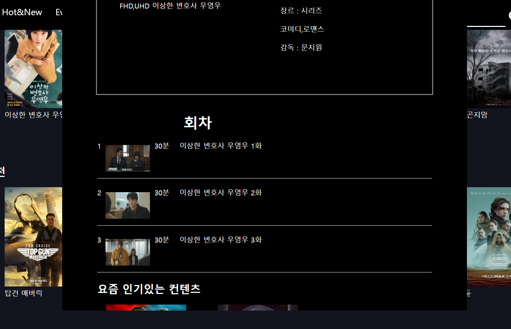

# team-project-WTT


### OTT 서비스 프로젝트 입니다. 


## 1. 개요


 - 프로젝트 명칭 : OTT와 커머셜을 한손에, WTT
 
 - 개발 기간: 2022. 06. 27 ~ 2022. 07.28
 
 - 팀 프로젝트: 4인
 
 - 서비스 간단 소개 : OTT 서비스와 커머셜 서비스를 통합 구현
 
 - 본인 구현 기능 :
 
    - 회원가입과 로그인 기능 및 유효성 검사 구현
    
    - 회원가입시 Naver API 이용한 이메일 인증
    
    - 메인 페이지와  DB 연결
    
    - 메인 페이지의 영상 클릭시 나오는 회차 
   
 
 
 
 <br/>
<br/>


# 2. 사용 기술
 ` Back-end `
 
- JAVA 11 
 
 
- Spring Boot 
 
 
- Maven 3.8.5

 
- Mybatis


 

<br/>
 
 ` Front-end 
 `
 - Bootstrap 
 
 - Javascript
 
 - jQuery 
  
<br/>

` Database `

- MYSQL


<br/>

` Development Tool `

 - Eclipse
 
 - Apachee-tomcat
 
  <br/>
    <br/>
      <br/>
 
 
 
 
 # 3. 본인 구현 기능 사진
 
 > 본인이 구현한 기능 사진 입니다.
 
 > 사진 첨부를 통한 기능을 간단히 설명합니다.
 
 
 
  <details> 
  
<summary> <H2> 사진 설명 펼치기 </H2> </summary>


## 1. INDEX


 <br/>
 
 > 인덱스 화면입니다.
<br/>
  <br/>
  

## 2. 회원가입 및 로그인


<br/>

> 회원가입 화면입니다.

- 네이버로 이메일 인증 후 가입 가능합니다.

- Ajax 를 사용하여 비밀번호와 비밀번호 확인을 비동기 방식으로 동일한지 실시간으로 감지합니다.

<br/>
  <br/>
  
## 2-1. 이메일 인증


 > 해당 이메일로부터 이메일 인증을 요청합니다.
 
  - 인증 요청과 회원가입 번호가 일치해야 회원가입 가능합니다.
  
  <br/>
    <br/>
  
 
 

## 2-3. 로그인 


 
> 로그인 화면 입니다.

<br/>

  <br/>
  
  
## 3. 메인 페이지


> 로그인 성공 시 메인 페이지 입니다.

 - 컨텐츠 화면에 마우스를 올려놓을 시 예고편 영상이 자동재생 됩니다.
 
 <br/>
  <br/>
  
## 3-1. 메인 페이지 컨텐츠 재생 버튼 클릭 시


> 메인 페이지 컨텐츠에서 재생버튼 클릭 시 토글입니다.

- 예고편 영상을 큰 화면으로 볼 수 있습니다.

<br/>
  <br/>
  
## 3-2. 메인 페이지 컨텐츠 ∨ 버튼 클릭시 


> 회차 및 시즌을 선택 가능합니다.

<br/>
  <br/>
  
## 3-3. 회차 선택 시



> 회차에 맞는 영상 정보가 나옵니다.

<br/>
  <br/>
  
## 3-4. 회차 컨텐츠 선택 시


> 영상 상세보기 페이지로 이동

</details>
 
 
 <br/>
 
  <br/>
 
  # 4. 기능 하이라이트
   
 > 본인이 구현한 기능 중 중요하다고 생각한 코드를 설명과 함께 적었습니다.
  
  <details> 
  
<summary> <H2> 주요 기능 펼치기 </H2> </summary>

 


 
 ## 1. 이메일 인증
 <br/>
 
 - UserController
 
 ```java
 
 //이메일 인증
   @RequestMapping(value="/mailCheck", method=RequestMethod.GET)
   @ResponseBody
   public String mailCheckGET(String email) throws Exception{
	   Random random = new Random();
	   int checkNum = random.nextInt(888888) + 111111;
	
	   /*이메일 보내기*/
	   String setFrom ="vytjdgus1234@naver.com";
	   String toMail = email;
       String title = "회원가입 인증 이메일 입니다.";
       String content = 
               "WTT를 이용해주셔서 정말 감사합니다." +
               "<br><br>" + 
               "인증 번호는 " + checkNum + "입니다." + 
               "<br>" + 
               "해당 인증번호를 인증번호 확인란에 기입하여 주세요.";
      
       try {
           
           MimeMessage message = mailSender.createMimeMessage();
           MimeMessageHelper helper = new MimeMessageHelper(message, true, "utf-8");
           helper.setFrom(setFrom);
           helper.setTo(toMail);
           helper.setSubject(title);
           helper.setText(content,true);
           mailSender.send(message);
           
       }catch(Exception e) {
           e.printStackTrace();
       }
      
       String num = Integer.toString(checkNum);
       
       return num;
   } 
   
   ```
 
 > Random 으로 난수값을 지정하고 mailSender API를 사용하여 보낼 이메일 내용을 커스텀해서 요청합니다.
 
 - 이메일 인증 Ajax 
 
 ```java
 
   /* 인증번호 이메일 전송*/
  $(".btnCheck").click(function(){
	  
	  var emailc = $(".email").val();
	  var checkBox =$(".mail_check_input");
	  var boxWrap =$(".mail_check_input_box");
	  var warnMsg =$(".mail_input_box_warn");
	  
	  /* 이메일 형식 유효성 검사 */
	    if(mailFormCheck(emailc)){
	        warnMsg.html("이메일이 전송 되었습니다. 이메일을 확인해주세요.");
	        warnMsg.css("display", "inline-block");
	    } else {
	        warnMsg.html(" @를 포함한 이메일 주소를 입력해주세요.");
	        warnMsg.css("display", "inline-block","color","red");
	        return false;
	    }    
	  
	  $.ajax({
		  type:"GET",
		  url:"mailCheck?email=" +emailc,
			success:function(data){
				 console.log("data :" + data);
				 checkBox.attr("disabled",false);
				 boxWrap.attr("id","mail_check_input_box_true");
				 code = data;
			} //success 펑션 종료
		  
	  }); //ajax 코드 종료
	  
  }); //인증번호 이메일 전송 function 종료
 
 ```
 
 - ajax를 통해 controller 와 데이터를 주고받습니다.
 
 - 이메일 인증 확인 ajax
 
 ```java
 
  /*인증번호 비교*/
   $(".mail_check_input").blur(function(){

 	  var inputCode = $(".mail_check_input").val();
 	  var checkResult = $("#mail_check_input_box_warn");

 	  if(inputCode == code){                            // 일치할 경우
 	        checkResult.html("인증번호가 일치합니다.");
 	        checkResult.attr("class", "correct");
 	        mailnumCheck = true;
 	    } else {                                            // 일치하지 않을 경우
 	        checkResult.html("인증번호를 다시 확인해주세요.");
 	        checkResult.attr("class", "incorrect");
 	        mailnumCheck = false;
 	    }


   });
 
 
 ```
 - 이메일 인증을 확인하는 절차를 거칩니다.
 
 <br/>
  <br/>
  
  
  ## 2. 회원가입 시 AES (복호화)
   > 회원가입 시 보안을 위해서 AES를 구현했습니다.
   
   - UserService
   
 
   ```java
   
  
   public boolean insert(UserVo vo) {
   
	 boolean b = true;
		try {
		
			String pwd = aes.enc(vo.getPwd());
			vo.setPwd(pwd);
			status =transaction.getTransaction(new DefaultTransactionDefinition());
			Mapper.insert(vo);
			transaction.commit(status);
		
		}catch(Exception ex) {
			ex.printStackTrace();
			b=false;
		}
		return b;
	}  
	
   ```
   
  > boolean 으로 return 받고 비밀번호는 AES처리 했으며 Transaction 의 과정도 거침 
	
<br/>
	 
- AES
	
```java
	
	
public class AES {
	String iv;
	Key keySpec;
	final static String key="12345678901234567890";
	
	public AES() {
		try {
			iv = key.substring(0,16);
			byte[] keyBytes = new byte[16];
			byte[] b= key.getBytes("utf-8");
			int len = b.length;
			if(len>keyBytes.length) len = keyBytes.length;
			
			System.arraycopy(b, 0, keyBytes, 0, len);
			SecretKeySpec keySpec = new SecretKeySpec(keyBytes, "AES");
			this.keySpec = keySpec;
		}catch(Exception ex) {
			ex.printStackTrace();
		}
	}
	
	public String enc(String str) {
		String encStr = "";
		try {
			Cipher c = Cipher.getInstance("AES/CBC/PKCS5Padding");
			c.init(Cipher.ENCRYPT_MODE, keySpec, new IvParameterSpec(iv.getBytes()));
			byte[] encrypted = c.doFinal(str.getBytes("utf-8"));
			encStr = new String(Base64.encodeBase64(encrypted));
		}catch(Exception ex) {
			ex.printStackTrace();
		}
		return encStr;
	}
	
	public String dec(String str) {
		String decStr = "";
		try {
			Cipher c = Cipher.getInstance("AES/CBC/PKCS5Padding");
			c.init(Cipher.DECRYPT_MODE, keySpec, new IvParameterSpec(iv.getBytes()));
			byte[] byteStr = Base64.decodeBase64(str.getBytes());
			decStr = new String(c.doFinal(byteStr), "utf-8");
		}catch(Exception ex) {
			ex.printStackTrace();
		}
		return decStr;
	}
	
	
	
}
	
```
> AES를 통해 복호화 하고자 함
	

	

 </details>
 
